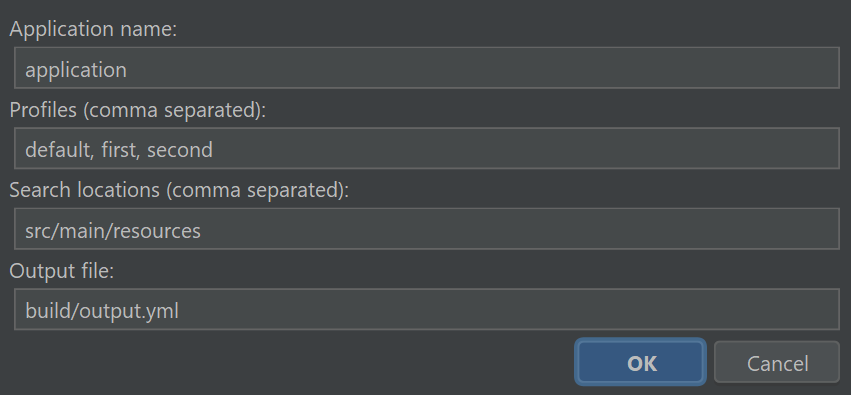

# spring-cloud-config-helper

Plugin that uses Spring Cloud Config API to combine specified application and profiles into a single config

---

## Usage

1. Install plugin
2. Press `Shift + Ctrl + P` and `Shift + Ctrl + M` for opening dialog

