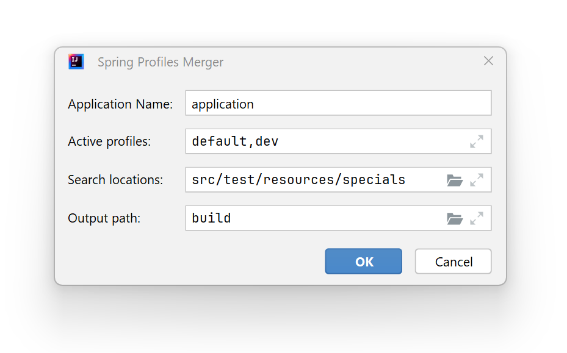

# spring-cloud-config-helper

Merge Spring application profiles into a single pretty YAML configuration.

---
Plugin based on Spring Cloud Config API. It's very handy for debugging configurations with many profiles.

## Installation

Directly in the IDE plugins section:

* Open `File --> Settings... --> Plugins --> Marketplace`
* Search for: `Spring Profiles Merger`
* Click `Install`

Or manually from [**JETBRAINS Marketplace**](https://plugins.jetbrains.com/) - website:
 * Go to the [plugin page](https://plugins.jetbrains.com/plugin/25327-spring-profiles-merger)
 * Download the plugin archive
 * Open `File --> Settings... --> Plugins`
 * Click **cogwheel button** and select `Install plugin from disk`

## Usage
<ol>
  <li>Press <samp>shift+ctrl+P</samp> and <samp>shift+ctrl+M</samp> to open plugin dialog</li>
  <li>Set the values:
    <ul>
      <li><b>Application name</b> - Spring application name (aka <samp>spring.application.name</samp>)</li>
      <li><b>Active profiles</b> - Comma separated profiles names (aka as <samp>spring.profiles.active</samp>)</li>
      <li><b>Search locations</b> - Comma separated directories contained configuration files</li>
      <li><b>Output path</b> - Where to save merged configuration</li>
    </ul>
  </li>
</ol>

## License

Please read the [license](LICENSE) file.